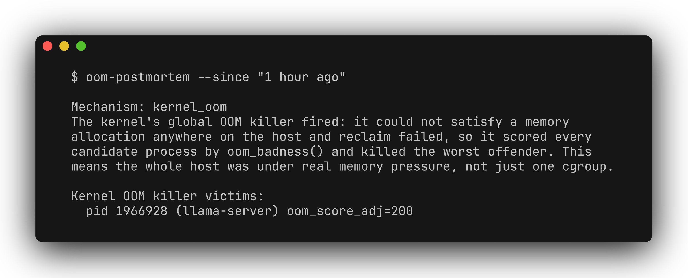

[](README.md) [](README.zh-CN.md)

# oom-postmortem

在一份只读报告中查看 Linux 的 OOM 证据：内核日志、systemd-oomd 日志和 cgroup v2 计数器。CLI 汇总检测到的机制，并列出相关进程或 cgroup 信息；支持 JSON 输出，便于脚本处理。



## 环境与安装

需要 Python 3.9+，以及使用 systemd、`journalctl` 和 cgroup v2 的 Linux 系统。不支持 macOS、Windows 或非 systemd 主机。完整读取日志和 cgroup 信息可能需要更高权限。

```bash
git clone https://github.com/zhuhroscar-tech/oom-postmortem.git
cd oom-postmortem
python3 -m venv .venv
source .venv/bin/activate
python -m pip install -e ".[dev]"
```

[Releases](https://github.com/zhuhroscar-tech/oom-postmortem/releases) 提供独立的 `oom-postmortem.pyz`。请先核对同一 release 中的 `SHA256SUMS.txt`，再使用 Python 3 运行，无需 pip 安装。发布历史记录在 [CHANGELOG.md](CHANGELOG.md)。

## 快速上手

```bash
oom-postmortem --since "1 hour ago"
oom-postmortem --since "1 hour ago" --json
python -m pytest -v
```

不加 `--since` 时，会检查可用日志和当前 cgroup 计数器。如遇权限问题，请使用有日志读取权限的账户，或明确选择提权运行，例如在本仓库目录中执行 `sudo .venv/bin/oom-postmortem --since "1 hour ago"`。

退出码：

| 代码 | 含义 |
| --- | --- |
| `0` | 在已检查的数据源中未发现 OOM 证据 |
| `2` | 发现 OOM 证据并完成分类；argparse 的参数错误也使用此代码 |
| `3` | 未发现正面证据，且至少一个数据源无法可靠读取 |

## 如何理解报告

分类优先级依次为内核事件、systemd-oomd、非零 cgroup `oom_kill` 计数器。请查看具体证据，不要只看标签：仅凭内核记录的被杀进程，不一定能区分全局内存耗尽与 cgroup 限额触发的 OOM。

`--since` 只过滤日志。cgroup 计数器是累计值，没有事件时间戳，可能反映更早的事故。工具不支持按指定 PID 或 unit 关联事件，也不能为所有同时发生的故障给出确定归因。

后续应按实际证据检查主机内存压力、unit 的 `ManagedOOMMemoryPressure=` 策略，或 `MemoryMax=`/容器内存限制。不要只根据汇总标签修改限额。

## 安全性

工具不会终止进程、修改配置、持久化状态、访问网络或发送遥测数据，只读取证据。日志缺失或 cgroup 已被删除时，诊断能力会受限。Linux 测试和产物构建流程见 [CI](.github/workflows/ci.yml)。

[MIT 许可证](LICENSE)。
